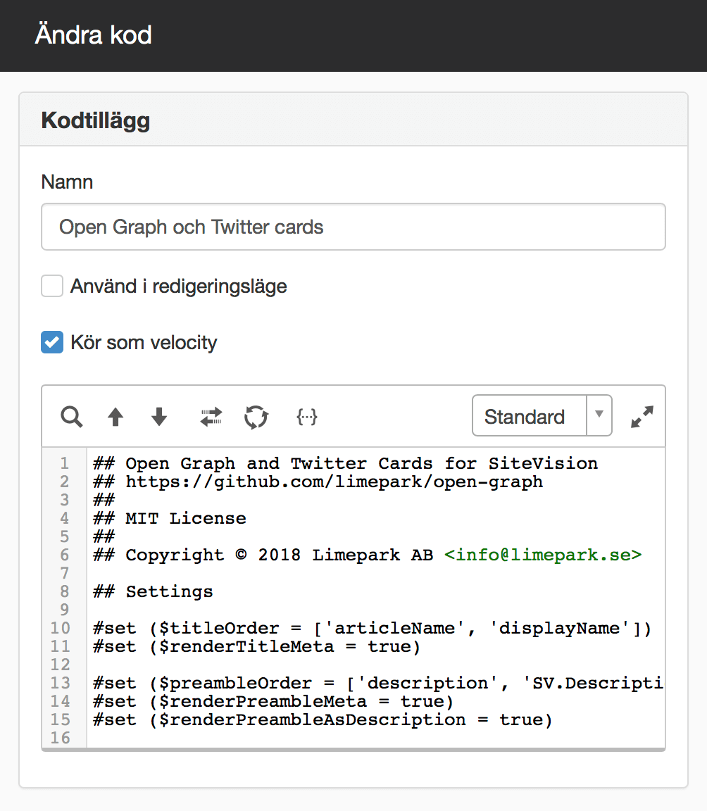
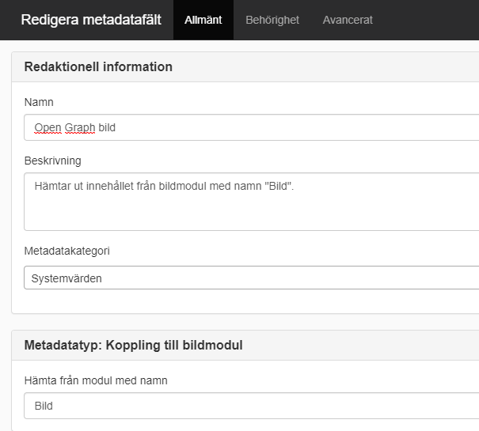
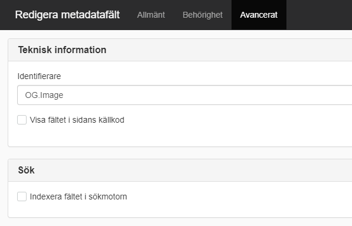
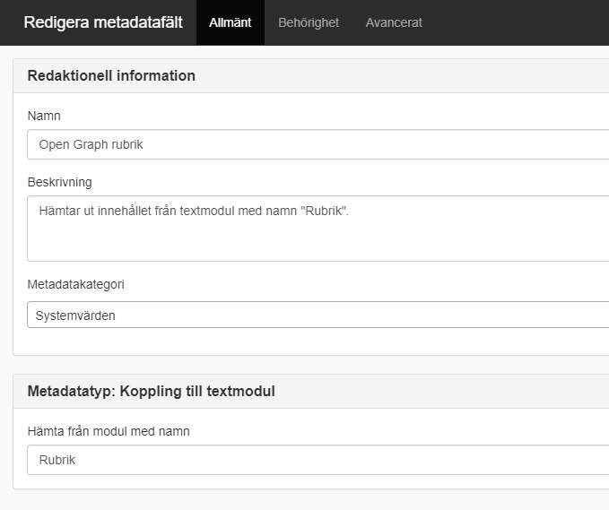
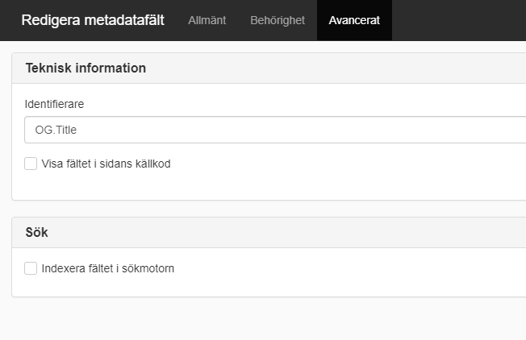
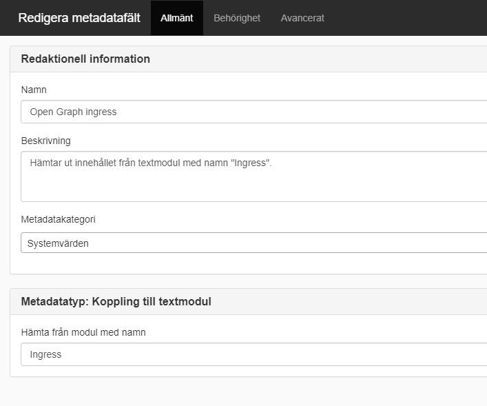
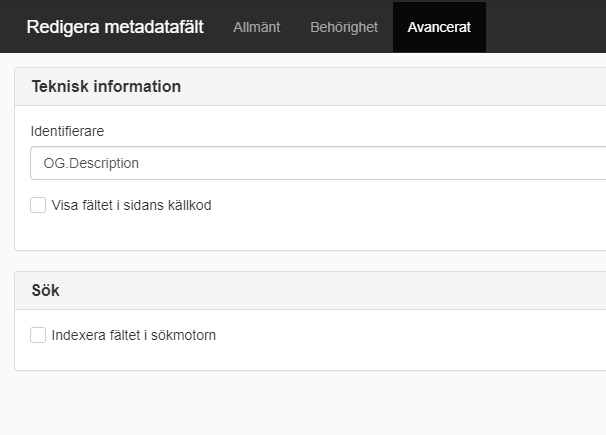

# Open Graph och Twitter Cards för SiteVision

Piffa upp dina delningar i sociala medier med stöd för [Open Graph-protokollet][og] och [Twitter Cards][tc] i SiteVision.

![][beforeafter]

## Problem med delningar i sociala medier?

Har du stött på trubbel när du försökt dela en länk på Facebook, Twitter eller någon annan social plattform? Kanske har rubriken blivit fel eller så har bilden på sidan inte följt med vid delningen.

Facebook & co gör sitt bästa för att förstå ditt innehåll men ibland räcker inte det ända fram. Vi kan behöva hjälpa dem på traven.

## Lösningen heter Open Graph

Open Graph är ett protokoll, framtaget av Facebook, som vi kan komplettera våra webbsidor och på så vis öka sannolikheten för att våra delningar blir som vi önskar. Den extra informationen finns bara i sidans HTML-kod och är inget som vanliga besökare märker av. Så här kan det se ut i källkoden:

```html
<meta property="og:url" content="https://sverigesradio.se/sida/artikel.aspx?programid=2071&artikel=6959317" />
<meta property="og:title" content="Sommarvärdar 2018 - hela listan - Sommar & Vinter i P1" />
<meta property="og:description" content="Här är Sommarvärdarna 2018! Årets Sommar i P1 sänds varje dag 23 juni-19 augusti." />
<meta property="og:image" content="https://static-cdn.sr.se/sida/images/2071/f0da65a1-924b-45ea-ac5b-ad73767d34b2.jpg" />
```

Exemplet är hämtat från en artikel på sverigesradio.se där sommarvärdarna presenteras. Om du granskar kodsnutten närmare hittar du rubrik, en kort beskrivning och länkar till en bild och själva artikeln. Den här informationen kan Facebook, och andra plattformar, enkelt hämta upp och använda när du delar länken i ditt flöde.

## Open Graph och SiteVision

SiteVision har inget inbyggt stöd för Open Graph men det går att lägga till själv. Limepark har hjälp många kunder med detta och även om deras önskemål brukar se något olika ut är grundidén den samma.

Med hjälp av ett kodtillägg och vanliga metadata i SiteVision genererar vi automatiskt den HTML som behövs för Open Graph.

Denna grund är du själv välkommen att använda och bygga vidare på under villkoren för [MIT-licensen][license].

## Kom igång

För att komma igång med Open Graph på din SiteVision-webbplats behöver du som minst installera ett så kallat kodtillägg. Förmodligen behöver du även komplettera med några nya metadata och anpassa dina inställningar.

### Installera kodtillägget

Kopiera innehållet i Velocitymallen [open-graph.vm][template] och klistra in det som ett [kodtillägg][codesnippet] i SiteVision. Förslagsvis på huset, så ärvs det nedåt till alla sidor på webbplatsen. Se till att kryssa i rutan *Kör som velocity*.



### Skapa nya metadata

Härnäst är det dags att skapa nya metadatafält. Det gör du genom att högerklicka på huset, välj sedan “Egenskaper” och sedan “Metadata”. Tryck därefter på “Lägg till metadatafält”, och för att lösningen ska fungera behöver vi metadatafält för bild, rubrik, och ingress.

Värdena för respektive metadatafält är enligt följande:

#### Bild



#### Rubrik



#### Ingress



### Anpassa inställningarna

Högt upp i Velocitymallen – mellan kommentarerna ```## Settings``` och ```## End of settings``` – hittar du inställningarna.

#### Titel

| Namn                            | Beskrivning                                                                                                                                                               |
|---------------------------------|---------------------------------------------------------------------------------------------------------------------------------------------------------------------------|
| **titleOrder**                  | Den ordning som den ska försöka hämta metadatavärden som ska skrivas ut som _og:title_.                                                                                   |
| **renderTitleMeta**             | Sätt till _false_ om inte meta-taggen ska renderas.                                                                                                                       |

#### Ingress

| Namn                            | Beskrivning                                                                                                                                                               |
|---------------------------------|---------------------------------------------------------------------------------------------------------------------------------------------------------------------------|
| **preambleOrder**               | Den ordning som den ska försöka hämta metadatavärden som ska skrivas ut som _og:description_.                                                                             |
| **renderPreambleMeta**          | Sätt till _false_ om inte meta-taggen ska renderas.                                                                                                                       |
| **renderPreambleAsDescription** | Om denna är _true_ skrivs även en ```<meta name="description">``` ut om ett värde hittas. Om _renderPreambleMeta_ är false så skrivs inte denna ut även om den är _true_. |
| **$maxPreambleLength**          | Maximalt antal tecken som ska skrivas ut av texten. Sätt till 0 för att skriva ut fullständiga texten.                                                                    |

#### Bild

| Namn                            | Beskrivning                                                                                                                                                               |
|---------------------------------|---------------------------------------------------------------------------------------------------------------------------------------------------------------------------|
| **imageOrder**                  | Den ordning som den ska försöka hämta metadatavärden som ska skrivas ut som _og:image_.                                                                                   |
| **renderImageMeta**             | Sätt till _false_ om inte meta-taggen ska renderas.                                                                                                                       |
| **imageFallbackUrl**            | Den bild som ska användas om ingen bild hittas, om denna är relativ (och börjar med /) så kommer sajtens host läsas ut och läggas till innan.                             |
| **imageFallbackWidth**          | Bredd på reservbilden.                                                                                                                                                    |
| **imageFallbackHeight**         | Höjd på reservbilden.                                                                                                                                                     |

## MIT-licens

Detta projekt är licensierat under MIT-licensen, se filen [LICENSE][license].

[og]: http://ogp.me
[tc]: https://developer.twitter.com/en/docs/tweets/optimize-with-cards/overview/abouts-cards
[template]: open-graph.vm
[codesnippet]: https://help.sitevision.se/SiteVision_4_0/codeSnippetHelp.html
[license]: LICENSE
[beforeafter]: docs/before-and-after.png
